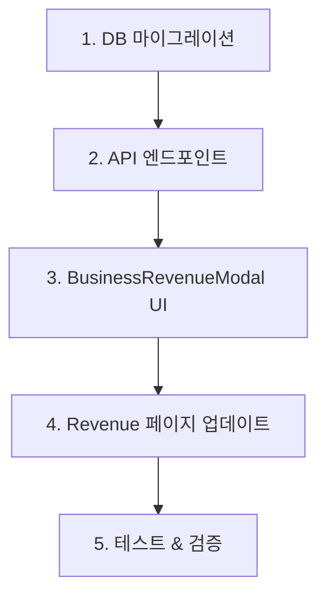

# AS 비용 및 커스텀 추가비용 구현 가이드

## 📌 구현 순서



---

## Step 1: 데이터베이스 마이그레이션

### 1.1 마이그레이션 파일 생성

```bash
# 파일: database/migrations/20250211_add_as_cost_and_custom_costs.sql
```

```sql
-- AS 비용 및 커스텀 추가비용 컬럼 추가
-- 작성일: 2025-02-11

BEGIN;

-- 1. 컬럼 추가
ALTER TABLE business_info
ADD COLUMN IF NOT EXISTS as_cost DECIMAL(12, 2) DEFAULT 0 CHECK (as_cost >= 0),
ADD COLUMN IF NOT EXISTS custom_additional_costs JSONB DEFAULT '[]'::jsonb;

-- 2. 기존 데이터 NULL 방지
UPDATE business_info
SET as_cost = 0
WHERE as_cost IS NULL;

UPDATE business_info
SET custom_additional_costs = '[]'::jsonb
WHERE custom_additional_costs IS NULL;

-- 3. NOT NULL 제약조건 추가
ALTER TABLE business_info
ALTER COLUMN as_cost SET NOT NULL,
ALTER COLUMN as_cost SET DEFAULT 0;

ALTER TABLE business_info
ALTER COLUMN custom_additional_costs SET NOT NULL,
ALTER COLUMN custom_additional_costs SET DEFAULT '[]'::jsonb;

-- 4. 인덱스 생성 (성능 최적화)
CREATE INDEX IF NOT EXISTS idx_business_info_as_cost
ON business_info(as_cost)
WHERE as_cost > 0; -- Partial index for efficiency

CREATE INDEX IF NOT EXISTS idx_business_info_custom_costs
ON business_info USING GIN (custom_additional_costs)
WHERE jsonb_array_length(custom_additional_costs) > 0; -- Partial index

-- 5. 코멘트 추가
COMMENT ON COLUMN business_info.as_cost IS 'AS(After Service) 비용 - 순이익 계산에 차감';
COMMENT ON COLUMN business_info.custom_additional_costs IS '사업장별 커스텀 추가비용 항목 - JSON 배열 [{id, name, amount}]';

-- 6. 검증 쿼리
DO $$
DECLARE
    v_count INTEGER;
BEGIN
    SELECT COUNT(*) INTO v_count
    FROM business_info
    WHERE as_cost IS NULL OR custom_additional_costs IS NULL;

    IF v_count > 0 THEN
        RAISE EXCEPTION 'Migration validation failed: NULL values found';
    END IF;

    RAISE NOTICE 'Migration completed successfully. Affected rows: %',
        (SELECT COUNT(*) FROM business_info);
END $$;

COMMIT;
```

### 1.2 마이그레이션 실행

```bash
# 로컬 환경
psql -U your_username -d facility_manager -f database/migrations/20250211_add_as_cost_and_custom_costs.sql

# 또는 Supabase SQL Editor에서 직접 실행
```

### 1.3 마이그레이션 검증

```sql
-- 컬럼 추가 확인
SELECT
    column_name,
    data_type,
    column_default,
    is_nullable
FROM information_schema.columns
WHERE table_name = 'business_info'
AND column_name IN ('as_cost', 'custom_additional_costs');

-- 인덱스 확인
SELECT
    indexname,
    indexdef
FROM pg_indexes
WHERE tablename = 'business_info'
AND indexname LIKE '%as_cost%' OR indexname LIKE '%custom_costs%';

-- 샘플 데이터 확인
SELECT
    business_name,
    as_cost,
    custom_additional_costs,
    jsonb_array_length(custom_additional_costs) as custom_cost_count
FROM business_info
LIMIT 5;
```

---

## Step 2: API 엔드포인트 구현

### 2.1 기존 API 라우트 수정

```tsx
// 파일: app/api/business-info/[id]/route.ts

import { createRouteHandlerClient } from '@supabase/auth-helpers-nextjs';
import { cookies } from 'next/headers';
import { NextResponse } from 'next/server';

export async function PATCH(
  request: Request,
  { params }: { params: { id: string } }
) {
  try {
    const supabase = createRouteHandlerClient({ cookies });
    const body = await request.json();

    // 허용된 필드만 추출
    const {
      as_cost,
      custom_additional_costs,
      // ... 기존 필드들
    } = body;

    // 업데이트 객체 구성
    const updates: any = {};

    // AS 비용 업데이트
    if (as_cost !== undefined) {
      const asCostValue = Number(as_cost);
      if (isNaN(asCostValue) || asCostValue < 0) {
        return NextResponse.json(
          { error: 'AS 비용은 0 이상의 숫자여야 합니다.' },
          { status: 400 }
        );
      }
      updates.as_cost = asCostValue;
    }

    // 커스텀 추가비용 업데이트
    if (custom_additional_costs !== undefined) {
      // 배열 검증
      if (!Array.isArray(custom_additional_costs)) {
        return NextResponse.json(
          { error: '커스텀 추가비용은 배열 형태여야 합니다.' },
          { status: 400 }
        );
      }

      // 각 항목 검증
      for (const cost of custom_additional_costs) {
        if (!cost.id || typeof cost.id !== 'string') {
          return NextResponse.json(
            { error: '각 항목에 유효한 ID가 필요합니다.' },
            { status: 400 }
          );
        }
        if (!cost.name || typeof cost.name !== 'string' || cost.name.trim().length === 0) {
          return NextResponse.json(
            { error: '각 항목에 유효한 이름이 필요합니다.' },
            { status: 400 }
          );
        }
        const amount = Number(cost.amount);
        if (isNaN(amount) || amount < 0) {
          return NextResponse.json(
            { error: '금액은 0 이상의 숫자여야 합니다.' },
            { status: 400 }
          );
        }
      }

      updates.custom_additional_costs = custom_additional_costs;
    }

    // 기존 필드 업데이트 로직...

    // 업데이트 실행
    if (Object.keys(updates).length === 0) {
      return NextResponse.json(
        { error: '업데이트할 데이터가 없습니다.' },
        { status: 400 }
      );
    }

    updates.updated_at = new Date().toISOString();

    const { data, error } = await supabase
      .from('business_info')
      .update(updates)
      .eq('id', params.id)
      .select()
      .single();

    if (error) {
      console.error('Database update error:', error);
      throw error;
    }

    return NextResponse.json(data);

  } catch (error: any) {
    console.error('Business info update error:', error);
    return NextResponse.json(
      { error: error.message || 'Failed to update business info' },
      { status: 500 }
    );
  }
}

// GET 메서드에서도 as_cost, custom_additional_costs 포함 확인
export async function GET(
  request: Request,
  { params }: { params: { id: string } }
) {
  try {
    const supabase = createRouteHandlerClient({ cookies });

    const { data, error } = await supabase
      .from('business_info')
      .select('*') // as_cost, custom_additional_costs 자동 포함
      .eq('id', params.id)
      .single();

    if (error) throw error;

    return NextResponse.json(data);
  } catch (error: any) {
    console.error('Business info fetch error:', error);
    return NextResponse.json(
      { error: error.message || 'Failed to fetch business info' },
      { status: 500 }
    );
  }
}
```

### 2.2 API 테스트

```bash
# AS 비용 업데이트 테스트
curl -X PATCH http://localhost:3000/api/business-info/[business-id] \
  -H "Content-Type: application/json" \
  -d '{"as_cost": 50000}'

# 커스텀 추가비용 업데이트 테스트
curl -X PATCH http://localhost:3000/api/business-info/[business-id] \
  -H "Content-Type: application/json" \
  -d '{
    "custom_additional_costs": [
      {"id": "uuid-1", "name": "특별수당", "amount": 30000},
      {"id": "uuid-2", "name": "긴급출장비", "amount": 20000}
    ]
  }'
```

---

## Step 3: BusinessRevenueModal UI 구현

### 3.1 타입 정의 추가

```tsx
// 파일: components/business/BusinessRevenueModal.tsx

// 타입 정의 (파일 상단)
interface CustomCost {
  id: string;
  name: string;
  amount: number;
}

interface DisplayData {
  // 기존 필드들...
  as_cost?: number;
  custom_additional_costs?: CustomCost[];
}
```

### 3.2 상태 관리 추가

```tsx
// AS 비용 상태
const [isEditingAsCost, setIsEditingAsCost] = useState(false);
const [asCostForm, setAsCostForm] = useState<{amount: number}>({amount: 0});
const [isSavingAsCost, setIsSavingAsCost] = useState(false);

// 커스텀 추가비용 상태
const [customCosts, setCustomCosts] = useState<CustomCost[]>([]);
const [isAddingCustomCost, setIsAddingCustomCost] = useState(false);
const [newCustomCost, setNewCustomCost] = useState<{name: string; amount: number}>({
  name: '',
  amount: 0
});
const [isSavingCustomCost, setIsSavingCustomCost] = useState(false);
```

### 3.3 데이터 로드 useEffect

```tsx
// AS 비용 초기 로드
useEffect(() => {
  if (displayData?.as_cost !== undefined) {
    setAsCostForm({amount: displayData.as_cost});
  }
}, [displayData?.as_cost]);

// 커스텀 추가비용 초기 로드
useEffect(() => {
  if (displayData?.custom_additional_costs) {
    setCustomCosts(displayData.custom_additional_costs);
  } else {
    setCustomCosts([]);
  }
}, [displayData?.custom_additional_costs]);
```

### 3.4 AS 비용 핸들러 함수

```tsx
// AS 비용 저장
const handleSaveAsCost = async () => {
  if (!business?.id) return;

  // 유효성 검사
  if (asCostForm.amount < 0) {
    toast.error('AS 비용은 0 이상이어야 합니다.');
    return;
  }

  setIsSavingAsCost(true);

  try {
    const response = await fetch(`/api/business-info/${business.id}`, {
      method: 'PATCH',
      headers: {'Content-Type': 'application/json'},
      body: JSON.stringify({as_cost: asCostForm.amount})
    });

    if (!response.ok) {
      const errorData = await response.json();
      throw new Error(errorData.error || 'AS 비용 저장 실패');
    }

    // 데이터 새로고침
    await refreshCalculation();
    setIsEditingAsCost(false);

    toast.success('AS 비용이 저장되었습니다.');
  } catch (error: any) {
    console.error('AS 비용 저장 오류:', error);
    toast.error(error.message || 'AS 비용 저장에 실패했습니다.');
  } finally {
    setIsSavingAsCost(false);
  }
};

// AS 비용 삭제 (0으로 설정)
const handleDeleteAsCost = async () => {
  if (!business?.id) return;

  if (!confirm('AS 비용을 삭제하시겠습니까?')) {
    return;
  }

  setIsSavingAsCost(true);

  try {
    const response = await fetch(`/api/business-info/${business.id}`, {
      method: 'PATCH',
      headers: {'Content-Type': 'application/json'},
      body: JSON.stringify({as_cost: 0})
    });

    if (!response.ok) throw new Error('AS 비용 삭제 실패');

    await refreshCalculation();
    setAsCostForm({amount: 0});

    toast.success('AS 비용이 삭제되었습니다.');
  } catch (error) {
    console.error('AS 비용 삭제 오류:', error);
    toast.error('AS 비용 삭제에 실패했습니다.');
  } finally {
    setIsSavingAsCost(false);
  }
};
```

### 3.5 커스텀 추가비용 핸들러 함수

```tsx
// 커스텀 비용 추가
const handleAddCustomCost = async () => {
  if (!business?.id) return;

  // 유효성 검사
  if (!newCustomCost.name || newCustomCost.name.trim().length === 0) {
    toast.error('항목명을 입력해주세요.');
    return;
  }

  if (newCustomCost.amount <= 0) {
    toast.error('금액은 0보다 커야 합니다.');
    return;
  }

  // 항목명 중복 체크
  if (customCosts.some(c => c.name === newCustomCost.name.trim())) {
    toast.error('이미 존재하는 항목명입니다.');
    return;
  }

  setIsSavingCustomCost(true);

  try {
    const newCost: CustomCost = {
      id: crypto.randomUUID(),
      name: newCustomCost.name.trim(),
      amount: newCustomCost.amount
    };

    const updatedCosts = [...customCosts, newCost];

    const response = await fetch(`/api/business-info/${business.id}`, {
      method: 'PATCH',
      headers: {'Content-Type': 'application/json'},
      body: JSON.stringify({custom_additional_costs: updatedCosts})
    });

    if (!response.ok) {
      const errorData = await response.json();
      throw new Error(errorData.error || '추가비용 저장 실패');
    }

    setCustomCosts(updatedCosts);
    setNewCustomCost({name: '', amount: 0});
    setIsAddingCustomCost(false);
    await refreshCalculation();

    toast.success('추가비용이 등록되었습니다.');
  } catch (error: any) {
    console.error('추가비용 저장 오류:', error);
    toast.error(error.message || '추가비용 저장에 실패했습니다.');
  } finally {
    setIsSavingCustomCost(false);
  }
};

// 커스텀 비용 수정
const handleEditCustomCost = async (costId: string, updatedName: string, updatedAmount: number) => {
  if (!business?.id) return;

  if (!updatedName || updatedName.trim().length === 0) {
    toast.error('항목명을 입력해주세요.');
    return;
  }

  if (updatedAmount <= 0) {
    toast.error('금액은 0보다 커야 합니다.');
    return;
  }

  setIsSavingCustomCost(true);

  try {
    const updatedCosts = customCosts.map(c =>
      c.id === costId
        ? {...c, name: updatedName.trim(), amount: updatedAmount}
        : c
    );

    const response = await fetch(`/api/business-info/${business.id}`, {
      method: 'PATCH',
      headers: {'Content-Type': 'application/json'},
      body: JSON.stringify({custom_additional_costs: updatedCosts})
    });

    if (!response.ok) throw new Error('추가비용 수정 실패');

    setCustomCosts(updatedCosts);
    await refreshCalculation();

    toast.success('추가비용이 수정되었습니다.');
  } catch (error) {
    console.error('추가비용 수정 오류:', error);
    toast.error('추가비용 수정에 실패했습니다.');
  } finally {
    setIsSavingCustomCost(false);
  }
};

// 커스텀 비용 삭제
const handleDeleteCustomCost = async (costId: string) => {
  if (!business?.id) return;

  if (!confirm('이 항목을 삭제하시겠습니까?')) {
    return;
  }

  setIsSavingCustomCost(true);

  try {
    const updatedCosts = customCosts.filter(c => c.id !== costId);

    const response = await fetch(`/api/business-info/${business.id}`, {
      method: 'PATCH',
      headers: {'Content-Type': 'application/json'},
      body: JSON.stringify({custom_additional_costs: updatedCosts})
    });

    if (!response.ok) throw new Error('추가비용 삭제 실패');

    setCustomCosts(updatedCosts);
    await refreshCalculation();

    toast.success('추가비용이 삭제되었습니다.');
  } catch (error) {
    console.error('추가비용 삭제 오류:', error);
    toast.error('추가비용 삭제에 실패했습니다.');
  } finally {
    setIsSavingCustomCost(false);
  }
};
```

### 3.6 순이익 계산 업데이트

```tsx
// 순이익 실시간 계산 (useMemo)
const calculatedNetProfit = useMemo(() => {
  const revenue = Number(displayData?.total_revenue || 0);
  const totalCost = Number(displayData?.total_cost || 0);
  const salesCommission = Number(displayData?.adjusted_sales_commission || displayData?.sales_commission || 0);
  const surveyCosts = Number(displayData?.survey_costs || 0);
  const installationCosts = Number(displayData?.installation_costs || 0);
  const additionalInstallation = Number(displayData?.additional_installation_revenue || 0);

  // 🆕 AS 비용 추가
  const asCost = Number(displayData?.as_cost || 0);

  // 🆕 커스텀 추가비용 총합
  const customCostTotal = customCosts.reduce((sum, c) => sum + c.amount, 0);

  return revenue - totalCost - salesCommission - surveyCosts - installationCosts - additionalInstallation - asCost - customCostTotal;
}, [displayData, customCosts]);
```

### 3.7 AS 비용 카드 JSX

```tsx
{/* AS 비용 카드 - 실사비용 조정 카드 바로 아래에 추가 */}
<div className="bg-blue-50 rounded-lg p-4 shadow-sm border-2 border-blue-300">
  <div className="flex items-center justify-between mb-2">
    <span className="text-sm font-medium text-gray-600">🔧 AS 비용</span>
    {!isEditingAsCost && userPermission >= 2 && (
      <div className="flex gap-2">
        <button
          onClick={() => setIsEditingAsCost(true)}
          className="text-xs text-blue-600 hover:text-blue-800 font-medium"
        >
          {displayData?.as_cost && displayData.as_cost !== 0 ? '수정' : '추가'}
        </button>
        {displayData?.as_cost && displayData.as_cost !== 0 && (
          <button
            onClick={handleDeleteAsCost}
            disabled={isSavingAsCost}
            className="text-xs text-red-600 hover:text-red-800 font-medium disabled:opacity-50"
          >
            삭제
          </button>
        )}
      </div>
    )}
  </div>

  {isEditingAsCost ? (
    <div className="space-y-2">
      <input
        type="number"
        placeholder="AS 비용 (원)"
        value={asCostForm.amount || ''}
        onChange={(e) => {
          const value = e.target.value;
          if (value === '') {
            setAsCostForm({amount: 0});
          } else {
            const numValue = Number(value);
            setAsCostForm({amount: isNaN(numValue) ? 0 : numValue});
          }
        }}
        className="w-full px-3 py-2 border border-gray-300 rounded text-sm focus:outline-none focus:ring-2 focus:ring-blue-500"
        min="0"
      />
      <p className="text-xs text-gray-500">
        💡 사업장의 AS(After Service) 관련 비용을 입력하세요
      </p>
      <div className="flex gap-2">
        <button
          onClick={handleSaveAsCost}
          disabled={isSavingAsCost || asCostForm.amount < 0}
          className="flex-1 px-3 py-2 bg-blue-600 text-white rounded text-sm hover:bg-blue-700 disabled:opacity-50 disabled:cursor-not-allowed font-medium"
        >
          {isSavingAsCost ? '저장 중...' : '저장'}
        </button>
        <button
          onClick={() => {
            setIsEditingAsCost(false);
            // 기존 값으로 복원
            const currentValue = displayData?.as_cost;
            if (currentValue !== null && currentValue !== undefined) {
              setAsCostForm({amount: currentValue});
            } else {
              setAsCostForm({amount: 0});
            }
          }}
          disabled={isSavingAsCost}
          className="flex-1 px-3 py-2 bg-gray-300 text-gray-700 rounded text-sm hover:bg-gray-400 disabled:opacity-50 font-medium"
        >
          취소
        </button>
      </div>
    </div>
  ) : (
    <div>
      {displayData?.as_cost && displayData.as_cost !== 0 ? (
        <p className="text-xl font-bold text-blue-700">
          {formatCurrency(displayData.as_cost)}
        </p>
      ) : (
        <p className="text-sm text-gray-500">AS 비용 없음</p>
      )}
      {!userPermission || userPermission < 2 ? (
        <p className="text-xs text-gray-400 mt-2">
          ℹ️ 권한 레벨 2 이상만 수정 가능합니다
        </p>
      ) : null}
    </div>
  )}
</div>
```

### 3.8 커스텀 추가비용 카드 JSX

```tsx
{/* 커스텀 추가비용 카드 - AS 비용 카드 바로 아래에 추가 */}
<div className="bg-orange-50 rounded-lg p-4 shadow-sm border-2 border-orange-300">
  <div className="flex items-center justify-between mb-2">
    <span className="text-sm font-medium text-gray-600">➕ 추가비용 항목</span>
    {userPermission >= 2 && !isAddingCustomCost && (
      <button
        onClick={() => setIsAddingCustomCost(true)}
        className="text-xs text-orange-600 hover:text-orange-800 font-medium"
      >
        항목 추가
      </button>
    )}
  </div>

  {/* 기존 커스텀 비용 목록 */}
  {customCosts.length > 0 ? (
    <div className="space-y-2 mb-3">
      {customCosts.map((cost) => (
        <div key={cost.id} className="flex items-center justify-between p-2 bg-white rounded border border-orange-200">
          <div className="flex-1">
            <p className="text-sm font-medium text-gray-700">{cost.name}</p>
            <p className="text-xs text-gray-500">{formatCurrency(cost.amount)}</p>
          </div>
          {userPermission >= 2 && (
            <button
              onClick={() => handleDeleteCustomCost(cost.id)}
              disabled={isSavingCustomCost}
              className="text-xs text-red-600 hover:text-red-800 ml-2 px-2 py-1 rounded hover:bg-red-50 disabled:opacity-50"
            >
              삭제
            </button>
          )}
        </div>
      ))}
    </div>
  ) : (
    <p className="text-sm text-gray-500 mb-3">등록된 추가비용 항목이 없습니다</p>
  )}

  {/* 새 항목 추가 폼 */}
  {isAddingCustomCost && (
    <div className="space-y-2 p-3 bg-white rounded border-2 border-orange-300">
      <input
        type="text"
        placeholder="항목명 (예: 긴급출장비, 특별수당 등)"
        value={newCustomCost.name}
        onChange={(e) => setNewCustomCost({...newCustomCost, name: e.target.value})}
        className="w-full px-3 py-2 border border-gray-300 rounded text-sm focus:outline-none focus:ring-2 focus:ring-orange-500"
        maxLength={50}
      />
      <input
        type="number"
        placeholder="금액 (원)"
        value={newCustomCost.amount || ''}
        onChange={(e) => {
          const value = e.target.value;
          if (value === '') {
            setNewCustomCost({...newCustomCost, amount: 0});
          } else {
            const numValue = Number(value);
            setNewCustomCost({...newCustomCost, amount: isNaN(numValue) ? 0 : numValue});
          }
        }}
        className="w-full px-3 py-2 border border-gray-300 rounded text-sm focus:outline-none focus:ring-2 focus:ring-orange-500"
        min="0"
      />
      <p className="text-xs text-gray-500">
        💡 사업장별로 발생하는 추가 비용을 자유롭게 등록하세요
      </p>
      <div className="flex gap-2">
        <button
          onClick={handleAddCustomCost}
          disabled={isSavingCustomCost || !newCustomCost.name || newCustomCost.amount <= 0}
          className="flex-1 px-3 py-2 bg-orange-600 text-white rounded text-sm hover:bg-orange-700 disabled:opacity-50 disabled:cursor-not-allowed font-medium"
        >
          {isSavingCustomCost ? '저장 중...' : '추가'}
        </button>
        <button
          onClick={() => {
            setIsAddingCustomCost(false);
            setNewCustomCost({name: '', amount: 0});
          }}
          disabled={isSavingCustomCost}
          className="flex-1 px-3 py-2 bg-gray-300 text-gray-700 rounded text-sm hover:bg-gray-400 disabled:opacity-50 font-medium"
        >
          취소
        </button>
      </div>
    </div>
  )}

  {/* 총합 표시 */}
  {customCosts.length > 0 && (
    <div className="mt-3 pt-3 border-t border-orange-200">
      <div className="flex justify-between items-center">
        <span className="text-sm font-medium text-gray-600">추가비용 총합</span>
        <span className="text-lg font-bold text-orange-700">
          {formatCurrency(customCosts.reduce((sum, c) => sum + c.amount, 0))}
        </span>
      </div>
    </div>
  )}

  {!userPermission || userPermission < 2 ? (
    <p className="text-xs text-gray-400 mt-2">
      ℹ️ 권한 레벨 2 이상만 수정 가능합니다
    </p>
  ) : null}
</div>
```

### 3.9 순이익 계산 공식 UI 업데이트

```tsx
{/* 순이익 계산 공식 섹션에 추가 */}
<div className="mt-4 bg-white rounded-lg p-4 border-2 border-blue-300">
  <h5 className="text-sm font-semibold text-gray-800 mb-3">📐 순이익 계산 공식</h5>
  <div className="text-sm text-gray-700 space-y-2 font-mono">
    {/* 기존 항목들... */}

    {/* 🆕 AS 비용 추가 */}
    {displayData?.as_cost && displayData.as_cost > 0 && (
      <div className="flex justify-between border-b border-gray-200 pb-2">
        <span>- AS 비용</span>
        <span className="font-bold text-blue-700">
          -{formatCurrency(Number(displayData.as_cost))}
        </span>
      </div>
    )}

    {/* 🆕 커스텀 추가비용 추가 */}
    {customCosts.length > 0 && (
      <>
        <div className="flex justify-between border-b border-gray-200 pb-2">
          <span>- 추가비용</span>
          <span className="font-bold text-orange-700">
            -{formatCurrency(customCosts.reduce((sum, c) => sum + c.amount, 0))}
          </span>
        </div>
        <div className="text-xs text-orange-600 pl-4 -mt-1 mb-2">
          {customCosts.map((c, idx) => (
            <div key={c.id}>
              ({c.name}: {formatCurrency(c.amount)}{idx < customCosts.length - 1 ? ' + ' : ''})
            </div>
          ))}
        </div>
      </>
    )}

    {/* 순이익 결과 */}
    <div className="flex justify-between border-t-2 border-blue-400 pt-3">
      <span className="font-bold text-lg">= 순이익</span>
      <span className={`font-bold text-lg ${calculatedNetProfit >= 0 ? 'text-blue-700' : 'text-red-700'}`}>
        {formatCurrency(calculatedNetProfit)}
      </span>
    </div>
  </div>
</div>
```

---

## Step 4: Revenue 페이지 업데이트

### 4.1 순이익 계산 로직 수정

```tsx
// 파일: app/admin/revenue/page.tsx

// 사업장별 순이익 계산 (필터링된 데이터에 대해)
const businessesWithCalculations = sortedBusinesses.map(business => {
  const revenue = Number(business.total_revenue || 0);
  const totalCost = Number(business.total_cost || 0);
  const salesCommission = Number(business.adjusted_sales_commission || business.sales_commission || 0);
  const surveyCosts = Number(business.survey_costs || 0);
  const installationCosts = Number(business.installation_costs || 0);
  const additionalInstallation = Number(business.additional_installation_revenue || 0);

  // 🆕 AS 비용 추가
  const asCost = Number(business.as_cost || 0);

  // 🆕 커스텀 추가비용 총합
  const customCosts = business.custom_additional_costs || [];
  const customCostTotal = Array.isArray(customCosts)
    ? customCosts.reduce((sum: number, c: any) => sum + (Number(c.amount) || 0), 0)
    : 0;

  const calculatedNetProfit = revenue - totalCost - salesCommission - surveyCosts - installationCosts - additionalInstallation - asCost - customCostTotal;

  return {
    ...business,
    calculated_net_profit: calculatedNetProfit
  };
});
```

### 4.2 모달 닫힘 후 데이터 갱신 확인

```tsx
// BusinessRevenueModal 닫힘 핸들러
const handleCloseRevenueModal = (dataChanged?: boolean) => {
  setSelectedBusinessForRevenue(null);
  setIsRevenueModalOpen(false);

  // 데이터가 변경되었으면 목록 새로고침
  if (dataChanged) {
    refreshBusinessList(); // 또는 loadBusinessData()
  }
};
```

---

## Step 5: 테스트 & 검증

### 5.1 단위 테스트 체크리스트

```
[ ] AS 비용 추가 기능
    [ ] 양수 값 저장
    [ ] 0 저장
    [ ] 음수 입력 방지
    [ ] 권한 레벨 2 미만 수정 불가
    [ ] 저장 후 모달 데이터 갱신
    [ ] 저장 후 테이블 갱신

[ ] AS 비용 수정 기능
    [ ] 기존 값 불러오기
    [ ] 값 변경 후 저장
    [ ] 취소 시 기존 값 복원

[ ] AS 비용 삭제 기능
    [ ] 삭제 확인 다이얼로그
    [ ] 삭제 후 0으로 설정
    [ ] 삭제 후 데이터 갱신

[ ] 커스텀 추가비용 추가 기능
    [ ] 항목명 + 금액 입력
    [ ] 항목명 중복 방지
    [ ] 빈 항목명 방지
    [ ] 0 이하 금액 방지
    [ ] 여러 항목 추가
    [ ] 권한 레벨 2 미만 수정 불가

[ ] 커스텀 추가비용 삭제 기능
    [ ] 개별 항목 삭제
    [ ] 삭제 확인 다이얼로그
    [ ] 삭제 후 데이터 갱신

[ ] 순이익 계산
    [ ] AS 비용 포함 계산
    [ ] 커스텀 추가비용 포함 계산
    [ ] 실시간 계산 (useMemo)
    [ ] 음수 순이익 표시

[ ] 데이터 동기화
    [ ] 모달에서 저장 → 테이블 갱신
    [ ] 새로고침 후 데이터 유지
    [ ] 여러 사업장 동시 편집
```

### 5.2 통합 테스트 시나리오

```
시나리오 1: AS 비용 추가 및 순이익 반영
1. Revenue 페이지에서 사업장 클릭 → 상세모달 열기
2. AS 비용 카드에서 "추가" 버튼 클릭
3. 50,000원 입력 후 저장
4. 순이익 계산 공식에 AS 비용 반영 확인
5. 모달 닫기
6. Revenue 페이지 테이블에서 순이익 업데이트 확인

시나리오 2: 커스텀 추가비용 여러 항목 등록
1. 상세모달에서 "항목 추가" 버튼 클릭
2. 항목명: "긴급출장비", 금액: 30,000원 입력 후 추가
3. 다시 "항목 추가" 버튼 클릭
4. 항목명: "특별수당", 금액: 20,000원 입력 후 추가
5. 추가비용 총합 50,000원 표시 확인
6. 순이익 계산에 50,000원 차감 확인
7. 모달 닫기 후 테이블 업데이트 확인

시나리오 3: 권한 레벨 테스트
1. 권한 레벨 1로 로그인
2. 상세모달 열기
3. AS 비용 및 추가비용 "추가" 버튼 비활성화 확인
4. "권한 레벨 2 이상만 수정 가능" 메시지 표시 확인

시나리오 4: 에러 처리
1. 항목명 없이 추가 시도 → "항목명을 입력해주세요" 에러
2. 금액 0 또는 음수 입력 → "금액은 0보다 커야 합니다" 에러
3. 중복 항목명 입력 → "이미 존재하는 항목명입니다" 에러
4. API 오류 발생 시 → 적절한 에러 메시지 표시
```

### 5.3 성능 테스트

```sql
-- 대량 데이터 성능 테스트
EXPLAIN ANALYZE
SELECT
  business_name,
  as_cost,
  custom_additional_costs,
  jsonb_array_length(custom_additional_costs) as custom_cost_count
FROM business_info
WHERE as_cost > 0
  OR jsonb_array_length(custom_additional_costs) > 0
LIMIT 100;

-- 인덱스 효율성 확인
SELECT
  schemaname,
  tablename,
  indexname,
  idx_scan,
  idx_tup_read,
  idx_tup_fetch
FROM pg_stat_user_indexes
WHERE tablename = 'business_info'
  AND (indexname LIKE '%as_cost%' OR indexname LIKE '%custom_costs%');
```

---

## 📝 완료 체크리스트

```
Phase 1: 데이터베이스
[ ] 마이그레이션 파일 작성
[ ] 마이그레이션 실행
[ ] 컬럼 추가 검증
[ ] 인덱스 생성 검증
[ ] 기존 데이터 NULL 방지 확인

Phase 2: API
[ ] PATCH 메서드 as_cost 처리 추가
[ ] PATCH 메서드 custom_additional_costs 처리 추가
[ ] 입력 검증 로직 추가
[ ] 에러 핸들링 추가
[ ] API 테스트 완료

Phase 3: BusinessRevenueModal
[ ] 타입 정의 추가
[ ] 상태 관리 추가
[ ] AS 비용 핸들러 구현
[ ] 커스텀 추가비용 핸들러 구현
[ ] AS 비용 카드 JSX 추가
[ ] 커스텀 추가비용 카드 JSX 추가
[ ] 순이익 계산 로직 업데이트
[ ] 순이익 계산 공식 UI 업데이트

Phase 4: Revenue 페이지
[ ] 순이익 계산 로직 업데이트
[ ] 모달 닫힘 후 갱신 확인
[ ] 테이블 데이터 동기화 확인

Phase 5: 테스트
[ ] 단위 테스트 완료
[ ] 통합 테스트 시나리오 실행
[ ] 성능 테스트 완료
[ ] 사용자 인수 테스트 완료
```

---

## 🚨 주의사항

1. **데이터 마이그레이션**
   - 프로덕션 배포 전 백업 필수
   - 마이그레이션 롤백 계획 준비

2. **권한 검증**
   - 클라이언트 + 서버 양쪽 권한 체크
   - API 레벨에서도 권한 검증 필요

3. **입력 검증**
   - 클라이언트 검증 외에 서버 검증 필수
   - SQL Injection 방지 (Supabase ORM 사용)

4. **성능 최적화**
   - JSONB 컬럼에 GIN 인덱스 활용
   - Partial index로 조건부 인덱싱

5. **UX 고려**
   - 저장 중 로딩 상태 표시
   - 명확한 성공/실패 피드백
   - 데이터 손실 방지 (취소 시 확인)

---

## 🎯 다음 단계

구현 완료 후:
1. 사용자 피드백 수집
2. 성능 모니터링
3. 추가 기능 검토 (히스토리, 통계 등)
4. 문서화 업데이트
