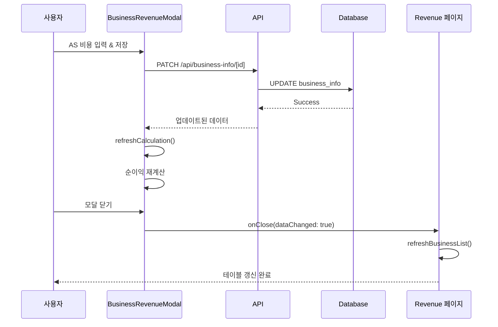

# AS 비용 및 커스텀 추가비용 기능 - 요약 문서

## 📌 기능 개요

admin/revenue 페이지의 상세모달에 **AS 비용**과 **커스텀 추가비용** 항목을 추가하여, 사업장별로 발생하는 다양한 비용을 유연하게 관리할 수 있도록 합니다. 이 비용들은 순이익 계산에 자동으로 반영됩니다.

---

## 🎯 핵심 기능

### 1. AS 비용 관리
- 사업장별 AS(After Service) 비용 입력/수정/삭제
- 영업비용조정, 실사비용 조정과 동일한 카드 UI 디자인
- 권한 레벨 2 이상만 수정 가능

### 2. 커스텀 추가비용 관리
- 항목명과 금액을 자유롭게 추가할 수 있는 동적 비용 항목
- 사업장별로 발생하는 다양한 추가 비용 관리
- 항목별 개별 삭제 가능
- 추가비용 총합 자동 계산 및 표시

### 3. 순이익 계산 자동 반영
```
순이익 = 총매출 - 매입 - 영업비용 - 실사비용 - 설치비 - AS비용 - 커스텀추가비용
```

### 4. 데이터 동기화
- 상세모달에서 저장 시 Revenue 페이지 테이블 자동 갱신
- 실시간 순이익 재계산

---

## 🗄️ 데이터베이스 변경사항

### 새로운 컬럼 추가 (`business_info` 테이블)

| 컬럼명 | 타입 | 기본값 | 설명 |
|--------|------|--------|------|
| `as_cost` | DECIMAL(12, 2) | 0 | AS 비용 (≥0) |
| `custom_additional_costs` | JSONB | `[]` | 커스텀 추가비용 배열 |

### 커스텀 추가비용 데이터 구조
```json
[
  {
    "id": "uuid-1",
    "name": "긴급출장비",
    "amount": 50000
  },
  {
    "id": "uuid-2",
    "name": "특별수당",
    "amount": 30000
  }
]
```

### 인덱스
- `idx_business_info_as_cost`: AS 비용 조회 최적화 (Partial index)
- `idx_business_info_custom_costs`: JSONB 쿼리 최적화 (GIN index)

---

## 🎨 UI/UX 미리보기

### AS 비용 카드
```
┌─────────────────────────────────────────┐
│ 🔧 AS 비용                       [수정] │
│                                          │
│ ₩50,000                                  │
│                                          │
│ [권한 레벨 2 이상만 수정 가능]           │
└─────────────────────────────────────────┘
```

### 커스텀 추가비용 카드
```
┌─────────────────────────────────────────┐
│ ➕ 추가비용 항목               [항목 추가] │
│                                          │
│ ┌────────────────────────────┐          │
│ │ 긴급출장비                    [삭제]    │
│ │ ₩30,000                               │
│ └────────────────────────────┘          │
│                                          │
│ ┌────────────────────────────┐          │
│ │ 특별수당                      [삭제]    │
│ │ ₩20,000                               │
│ └────────────────────────────┘          │
│                                          │
│ ───────────────────────────────          │
│ 추가비용 총합             ₩50,000        │
└─────────────────────────────────────────┘
```

---

## 📊 순이익 계산 공식 업데이트

```
매출금액                    ₩10,000,000
- 매입금액                  -₩5,000,000
= 총 이익                   ₩5,000,000
- 영업비용                  -₩1,200,000
- 실사비용                  -₩300,000
- 기본설치비                -₩800,000
- AS 비용          🆕       -₩50,000
- 추가비용         🆕       -₩50,000
────────────────────────────────────
= 순이익                    ₩2,600,000
```

---

## 🔄 데이터 흐름



---

## 📁 변경 파일 목록

### 1. 데이터베이스 (신규)
```
database/migrations/20250211_add_as_cost_and_custom_costs.sql
```

### 2. API 엔드포인트 (수정)
```
app/api/business-info/[id]/route.ts
  - PATCH 메서드에 as_cost, custom_additional_costs 처리 추가
  - 입력 검증 로직 추가
  - 에러 핸들링 강화
```

### 3. BusinessRevenueModal (수정)
```
components/business/BusinessRevenueModal.tsx
  - AS 비용 상태 관리 및 핸들러 추가
  - 커스텀 추가비용 상태 관리 및 핸들러 추가
  - AS 비용 카드 UI 추가
  - 커스텀 추가비용 카드 UI 추가
  - 순이익 계산 로직 업데이트 (useMemo)
  - 순이익 계산 공식 UI 업데이트
```

### 4. Revenue 페이지 (수정)
```
app/admin/revenue/page.tsx
  - 순이익 계산 로직에 AS 비용 반영
  - 순이익 계산 로직에 커스텀 추가비용 반영
  - 모달 닫힘 후 데이터 갱신 처리
```

---

## ✅ 구현 체크리스트

### Phase 1: 데이터베이스 (필수)
- [ ] 마이그레이션 파일 작성
- [ ] 로컬 환경 마이그레이션 실행
- [ ] 컬럼 추가 검증
- [ ] 인덱스 생성 검증

### Phase 2: API (필수)
- [ ] `/api/business-info/[id]` PATCH 메서드 수정
- [ ] as_cost 처리 로직 추가
- [ ] custom_additional_costs 처리 로직 추가
- [ ] 입력 검증 및 에러 핸들링 추가

### Phase 3: BusinessRevenueModal (필수)
- [ ] 타입 정의 추가
- [ ] 상태 관리 추가
- [ ] AS 비용 핸들러 구현
- [ ] 커스텀 추가비용 핸들러 구현
- [ ] AS 비용 카드 UI 추가
- [ ] 커스텀 추가비용 카드 UI 추가
- [ ] 순이익 계산 로직 업데이트

### Phase 4: Revenue 페이지 (필수)
- [ ] 순이익 계산 로직 업데이트
- [ ] 데이터 동기화 확인

### Phase 5: 테스트 (필수)
- [ ] AS 비용 CRUD 테스트
- [ ] 커스텀 추가비용 CRUD 테스트
- [ ] 순이익 계산 정확성 검증
- [ ] 권한 레벨 검증
- [ ] 데이터 동기화 확인

---

## 🔐 보안 및 권한

### 권한 레벨
- **Level 2 이상**: AS 비용, 커스텀 추가비용 추가/수정/삭제 가능
- **Level 1 이하**: 읽기 전용

### 입력 검증
- **AS 비용**: 0 이상의 숫자만 허용
- **커스텀 추가비용 항목명**: 1~50자, 중복 불가
- **커스텀 추가비용 금액**: 0보다 큰 숫자만 허용

### 보안 조치
- 서버 사이드 입력 검증 (클라이언트 검증 외 추가)
- SQL Injection 방지 (Supabase ORM 사용)
- CSRF 방지 (Next.js 기본 보안)

---

## 📈 예상 효과

### 1. 유연한 비용 관리
- 사업장별로 발생하는 다양한 비용을 자유롭게 추가 가능
- AS 비용과 같은 특정 비용 항목 별도 관리
- 커스텀 항목으로 예상치 못한 비용도 관리 가능

### 2. 정확한 수익성 분석
- 실제 발생하는 모든 비용을 순이익 계산에 반영
- 사업장별 정확한 수익성 파악
- 비용 누락으로 인한 오류 방지

### 3. 데이터 무결성
- 실시간 순이익 계산으로 데이터 일관성 유지
- 모달-테이블 간 자동 동기화
- 히스토리 추적 가능한 구조

### 4. 확장성
- JSONB 컬럼으로 유연한 데이터 구조
- 향후 비용 항목 추가 시 스키마 변경 불필요
- 통계 및 분석 기능 확장 용이

---

## 🚀 배포 계획

### 개발 환경
1. 마이그레이션 실행
2. 기능 구현 및 단위 테스트
3. 통합 테스트

### 스테이징 환경
1. 스테이징 DB 마이그레이션
2. E2E 테스트
3. 사용자 시나리오 검증

### 프로덕션 환경
1. **배포 전**
   - 데이터베이스 백업
   - 롤백 계획 준비
   - 배포 시간대 확인 (트래픽 적은 시간)

2. **배포**
   - 마이그레이션 실행
   - 애플리케이션 배포
   - Health check

3. **배포 후**
   - 기능 동작 확인
   - 성능 모니터링
   - 에러 로그 확인

---

## 📚 참고 문서

1. **상세 설계 문서**: `DESIGN_as_cost_and_custom_costs.md`
   - 전체 시스템 아키텍처
   - 데이터베이스 설계
   - UI/UX 설계
   - 계산 로직

2. **구현 가이드**: `IMPLEMENTATION_GUIDE_as_cost_and_custom_costs.md`
   - 단계별 구현 방법
   - 코드 예제
   - 테스트 시나리오
   - 체크리스트

---

## 💡 추가 고려사항 (선택)

### 향후 확장 가능 기능
1. **히스토리 추적**
   - 비용 변경 이력 로깅
   - 변경 사유 및 담당자 기록

2. **통계 및 분석**
   - AS 비용 트렌드 분석
   - 커스텀 비용 항목별 집계
   - 대시보드 차트 추가

3. **자동화**
   - 정기적으로 발생하는 비용 자동 등록
   - 비용 임계값 알림

4. **엑셀 내보내기**
   - 커스텀 비용 항목 포함 리포트
   - 사업장별 비용 상세 내역

---

## 🤝 팀 커뮤니케이션

### 개발팀
- 데이터베이스 마이그레이션 일정 조율
- API 변경사항 공유
- 코드 리뷰 요청

### 기획/운영팀
- 기능 데모 및 피드백 수집
- 사용자 가이드 작성
- 교육 자료 준비

### QA팀
- 테스트 시나리오 공유
- 버그 리포트 템플릿
- 성능 테스트 결과 공유

---

## 📞 문의 및 지원

구현 중 문제가 발생하거나 궁금한 사항이 있으면:
1. 상세 설계 문서 참고
2. 구현 가이드 체크리스트 확인
3. 기술 리드에게 문의

---

**작성일**: 2025-02-11
**작성자**: Claude Code Design Assistant
**버전**: 1.0
**상태**: 설계 완료, 구현 대기
